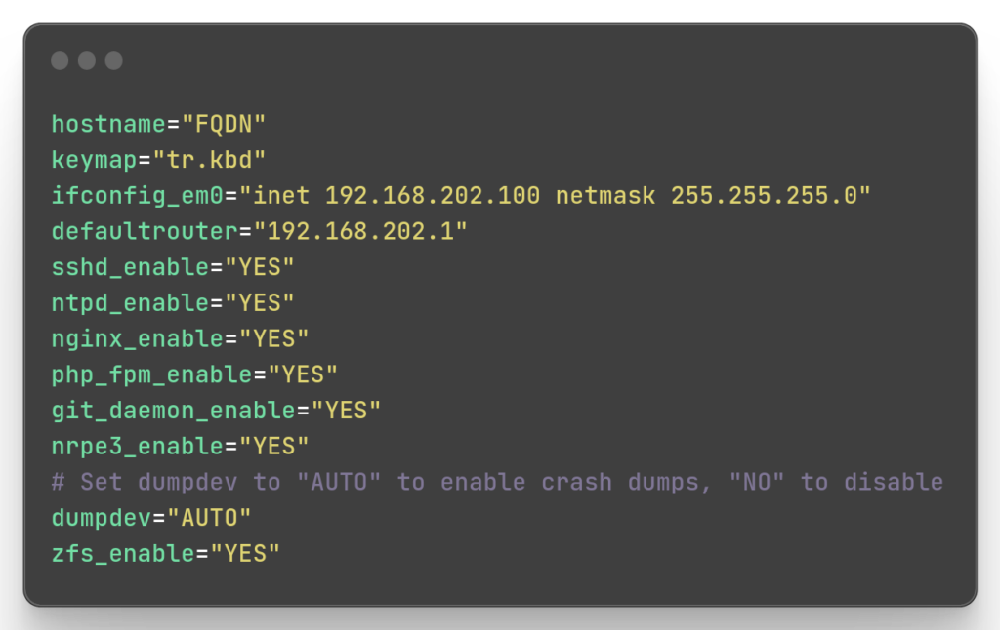

# FreeBSD Sisteminde /etc/rc.conf dosyası nedir ne işe yarar ?


Bu yazıda FreeBSD sistemlerde çok önemli bir işleve sahip olan ```/etc/rc.conf``` dosyası ile ilgili bilgilere yer vermek istiyorum.

Çok basit bir anlatımla; FreeBSD işletim sisteminde ```/etc/rc.conf``` dosyası, sistem yapılandırmasını kontrol etmek için kullanılan önemli bir dosyadır. Bu dosya, sistem başlatıldığında veya durdurulduğunda çalıştırılacak veya durdurulacak hizmetlerin ve sistem ayarlarının yapılandırılmasını sağlar.

```rc.conf```'nin amacı, doğrudan komutları çalıştırmak veya sistem başlangıç eylemlerini gerçekleştirmek değildir. Bunun yerine, ```/etc``` dizinindeki çeşitli genel başlangıç betikleri tarafından dahil edilir ve içerideki ayarlara göre bazı eylemleri gerçekleştirir. ```/etc/rc.conf``` dosyası, tüm mevcut seçenekler için varsayılan ayarları belirleyen ```/etc/defaults/rc.conf``` dosyasından dahil edilir. Sistem yöneticisi bu varsayılanları geçersiz kılmak istediğinde, seçenekler yalnızca ```/etc/rc.conf``` dosyasında belirtilmelidir, **```/etc/defaults/rc.conf``` dosyasında bir düzenleme yapılmamalıdır.**

Aşağıda örnek bir ```rc.conf``` dosyası bulunuyor;



Görüldüğü gibi makine host adı, ağ arabirimi yapılandırması, ağ geçidi, sistem başlarken başlaması istenen bazı servisler bu dosyada belirtilmiş halde.

```x_enable="YES"``` ifadesi, ```/etc/rc.conf``` dosyasında bir hizmetin veya özelliğin etkinleştirilmesi için kullanılır. ```"x"``` kısmı, özelliği temsil eden bir etiket veya tanımlayıcı olabilir ve ```"enable"``` kelimesi, söz konusu özelliğin veya hizmetin etkinleştirildiğini belirtir. ```"YES"``` ise etkinleştirme işaretidir.

Örneğin, yukarıdaki ```/etc/rc.conf``` dosyasında ```sshd_enable="YES"``` ifadesi var. Bu ifade, SSH (Secure Shell) hizmetinin sistem başlatıldığında otomatik olarak etkinleştirileceğini belirtir. Yani, her seferinde SSH hizmetini manuel olarak başlatmak zorunda kalmazsınız, sistem başlatıldığında SSH hizmeti de otomatik olarak başlatılır.

```x_enable="YES"``` ifadesi, sistem yöneticilerine, ```/etc/rc.conf``` dosyasında belirli hizmetleri veya özellikleri etkinleştirme veya devre dışı bırakma esnekliği sunar. Dosyayı düzenleyerek, sistem başlangıcında çalışmasını istediğiniz hizmetleri belirleyebilir ve gerektiğinde devre dışı bırakabilirsiniz.

Sonuç olarak, ```/etc/rc.conf``` dosyası FreeBSD işletim sisteminde sistem yapılandırmasını kontrol etmek için kullanılır. ```x_enable="YES"``` ifadesi, ```/etc/rc.conf``` dosyasında belirli bir hizmetin veya özelliğin etkinleştirildiğini gösterir ve sistem başlangıcında otomatik olarak başlatılmasını sağlar.

Bazı servislerin başlatılabilir olması için başlatma betikleri ```x_enable="YES"``` ifadesinin ```rc.conf``` dosyasında bulunmasını özellikle ister. Bu uygulamaları başlatmak istediğinizde hata alırsınız. Bu nedenle FreeBSD sistemlerde ```rc.conf``` kullanımına alışmanız ve özümsemeniz gerekir.

İyi çalışmalar..

# Lisans

Bu makale Bedreddin Şahbaz tarafından yazılmıştır. BSD-3-Clause ile ruhsatlanmıştır.
