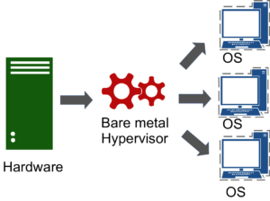
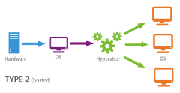

# Proxmox VE Nedir? Sanallaştırma ve Konteynerleme İçin Uygun Çözüm

Merhaba,

Sizelere bu yazımda bir sanallaştırma aracı olan [Proxmox VE](https://www.proxmox.com/en/)‘den bahsetmek istiyorum. Neticede FreeBSD işletim sistemimizi üzerinde çalıştıracağımız bir platform lazım ve bu çağda artık bu platform “sanal” olmaya daha yakın. Ben de açık kaynak kodlu ve ücretsiz bir bare-metal sanallaştırma aracı olan [Proxmox VE](https://www.proxmox.com/en/) hakkında sizlere bir kaç bilgi vermek istiyorum.

Öncelikle biraz tarihçesinden bahsedelim; Proxmox VE’nin kökenleri, 2005 yılına dayanmaktadır. Almanya merkezli bir yazılım şirketi olan Proxmox Server Solutions GmbH tarafından geliştirilmeye başlanmıştır. İlk başlarda Proxmox adı altında sadece sanallaştırma teknolojileri üzerine odaklanan bir platform olarak piyasaya sürülmüştür. Proxmox Server Solutions GmbH, geliştiricileri Martin Maurer ve Dietmar Maurer tarafından kurulmuştur. İkisi de Linux tabanlı sanallaştırma teknolojilerine olan tutkularıyla bir araya gelerek, kullanıcı dostu ve yenilikçi bir çözüm sunma hedefiyle Proxmox VE’yi hayata geçirmiştir.

Şu ada geldiğimiz noktada Proxmox VE sürekli gelişimini sürdüren ve kullanıcı geri bildirimlerine dayalı olarak Proxmox VE’yi güncellenen, kullanıcı dostu bir deneyim sunan ve açık kaynak topluluğuyla işbirliği yapan faal bir projedir.

Peki nedir bu Proxmox VE?

Proxmox VE, fiziksel sunucuları sanal sunuculara dönüştürmek ve birleşik bir yönetim arayüzü üzerinden bu sunucuları kolayca kontrol etmek için kullanılan bir sanallaştırma platformudur. OpenVZ konteynerlerini ve KVM (Kernel-based Virtual Machine) sanallaştırma teknolojisini destekler. Proxmox VE, kullanıcılarına hem sanal makineler hem de konteynerler için yönetim kolaylığı sağlar. Çok fazla detaya girmeden bu şekilde açıklayabileceğimiz Proxmox VE bir bare-metal sanallaştırma ortamı sunar. Bu noktada bu hipervizör türleri hakkında ufak bir bilgi vermek yerinde olacaktır. İki tür sanallaştırmadan bahsetmek olası bunları aşağıda çok kısa olarak özetlemek isterim.

## Type 1 ( Bare Metal Hypervisor )

Yüklenmiş olduğu donanım üzerinde bulunan fiziksel kaynakları; bellek, işlemci, network kartı ve veri havuzu gibi fiziksel kaynaklara bire-bir erişim sağlayan Hypervisor türüdür. Çalışma mantığını daha iyi anlamak için şemaya göz atabilirsiniz;

Bu türe örnekler;

* Proxmox VE
* Microsoft Hyper-V Server
* Vmware ESX Server
* Citrix XEN Server

## Type 2 (Hosted Hypervisor)

Bu türde sanallaştırma aracı Hosted Operating System üzerinde çalışır. Sanal makineler ise bu ortam üzerinde çalıştırılır. Çalışma mantığı için aşağıdaki şemaya göz atabilir ve bunu Type 1 ile kıyaslayabilirsiniz. Böylece aslında aralarındaki farkı da anlamış olacaksınız;

Bu türe örnekler;

* Vmware Workstation
* VirtualBOX
* Windows 10 üzerinde kullanılmakta olan Hyper-V Client

## Proxmox VE ile neler yapabiliriz?

Proxmox VE, veri merkezleri için birden fazla avantaj sunar. İşte Proxmox VE’nin temel kullanım alanları:

a. Sanal Sunucu Oluşturma: Proxmox VE, fiziksel sunucuların sanal sunuculara dönüştürülmesine izin verir. Bu sayede, donanım kaynaklarını daha etkin bir şekilde kullanabilir ve birden çok sunucuyu tek bir donanım platformunda barındırabilirsiniz.

b. Konteynerleme: Proxmox VE, OpenVZ konteynerlerini destekleyerek uygulamaları izole etmek ve kaynakları daha verimli bir şekilde paylaşmak için konteynerleme teknolojisini kullanır. Bu, daha hafif ve daha hızlı çalışan uygulamaların sağlanmasını sağlar.

c. Yüksek Erişilebilirlik: Proxmox VE, sunucu düğümlerinde yüksek erişilebilirlik (high availability) sağlamak için failover ve cluster özelliklerini destekler. Bu, kesintisiz çalışma ve hizmet sürekliliği sağlar.

d. Yedekleme ve Geri Yükleme: Proxmox VE’nin dahili yedekleme ve geri yükleme özellikleri, sanal makinelerin ve konteynerlerin verilerini korumanıza yardımcı olur. Kapsamlı yedekleme politikaları oluşturabilir ve veri kaybı riskini azaltabilirsiniz (Bu konuda yine aynı firmaca yürütülen Proxmox Backup Server -PBS- ile ilgili de bir yazı hazırlamayı düşünüyorum).

## Proxmox VE’nin avantajları nelerdir?

Proxmox VE tercih etmek için bir kaç neden:

a. Ücretsiz ve Açık Kaynaklı: Proxmox VE, açık kaynak bir projedir ve ücretsiz olarak kullanılabilir. Bu, maliyetleri düşürür ve bütçe dostu bir çözüm sunar.

b. Kolay Yönetim Arayüzü: Proxmox VE, kullanıcı dostu bir web tabanlı arayüz üzerinden sunucuları yönetmeyi kolaylaştırır. Sanal makineleri oluşturma, yapılandırma ve izleme gibi işlemler basit bir şekilde gerçekleştirilebilir.

c. Güçlü Sanallaştırma Teknolojileri: Proxmox VE, KVM ve OpenVZ gibi güçlü sanallaştırma teknolojilerini destekler. Bu, farklı kullanım senaryolarına uygun esnek bir çözüm sunar.

d. Topluluk Desteği: Proxmox VE, geniş bir kullanıcı topluluğuna sahiptir ve aktif bir şekilde geliştirilmektedir. Sorunlarınızı çözebilmeniz ve yeni özellikler keşfedebilmeniz için sağlam bir destek ağına sahip olursunuz.

Sonuç olarak; Proxmox VE, sanallaştırma ve konteynerleme için güçlü ve etkili bir açık kaynaklı platformdur. Sanal sunucu oluşturma, konteynerleme, yüksek erişilebilirlik ve yedekleme gibi bir dizi özellik sunarak verimliliğinizi artırır. Ücretsiz ve kullanıcı dostu bir arayüzüyle birlikte gelir ve geniş bir topluluk desteği sunar. Bu avantajları sebebi ile bir süredir FreeBSD sunucularımı Proxmox VE üzerinde kurup yönetiyorum. Sizlere de tavsiye ederim..

# Lisans

Bu makale Bedreddin Şahbaz tarafından yazılmıştır. BSD-3-Clause ile ruhsatlanmıştır.