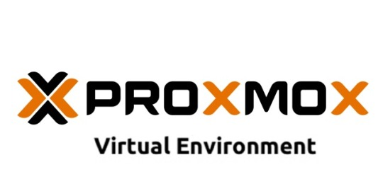

Proxmox VE ile ilgili deneyimlediğim bir işlemi daha buraya yazmak istedim. Proxmox VE sürümü ben kurulum yaptığımda 7.1 idi ve sonrasında 7.2 sürümü kullanıma sunuldu. 7.2 sürümü ile gelen değişimlere şu adrese göz atarak bakabilirsiniz ([Proxmox Virtual Environment 7.2 released](https://www.proxmox.com/en/news/press-releases/proxmox-virtual-environment-7-2-available)) Ben de 7.1 olan sürümümü güncelleyerek 7.2 yapmak istedim ve bu konuda biraz araştırma yaptım. Proxmox VE yazılımını ücretsiz olarak kullanıyorsanız bu güncellemeyi yapabilmek için bazı işlemler yapmanız gerekmekte. Proxmox VE depoları ile ilgili detaylı bilgi için [https://pve.proxmox.com/wiki/Package_Repositories](https://pve.proxmox.com/wiki/Package_Repositories) adresini ziyaret edebilirsiniz.

**Burada önemli bir UYARI!** Proxmox VE yazılımını üye olmadan kullandığımız için Proxmox VE No-Subscription deposunu kullanacağız ve bu depo “production” ortamları için önerilmiyor. Çünkü bu depodaki paketler yeterince test edilmemiş ve doğrulanmamış olabiliyor. Ben bu riski minimize etmek için işleme başlamadan önce tüm sanal makinelerimin yedeğini aldım ve öncesinde test amaçlı kurduğum başka bir Proxmox VE üzerinde güncelleme işlemi yapıp sorun olmadığını teyit ettim. Siz de kendinizce önlemler alınız.
Gelelim yapılması gerekenlere. Aslında çok zor ve uzun bir işlem değil. Öncelikle pve-no-subscription deposunu elle eklememiz lazım. Bunun için ssh ile sunucumuza bağlanıp nano ile şu yoldaki dosyayı açalım;

```
# nano /etc/apt/sources.list
```

Açtığımız dosyanın sonuna şu satırları ekleyelim;

```
# PVE pve-no-subscription repository provided by proxmox.com,
# NOT recommended for production use
deb http://download.proxmox.com/debian/pve bullseye pve-no-subscription
```

ctrl+x ve Yes ile dosyada yaptığımız değişimi kaydedip çıkalım. Bundan sonra vermemiz gereken komutlar;

```
# apt update && apt dist-upgrade
```

Bu komutların sonunda sistem güncellenmiş olacak. Güncelleme bittikten sonra tüm sanal makinelerinizi durdurup Proxmox VE sunucunuzu yeniden başlatın;

```
# reboot
```

Sunucunuz yeniden başladığında Proxmox VE sürüm bilgisini kontrol edin. İyi çalışmalar..