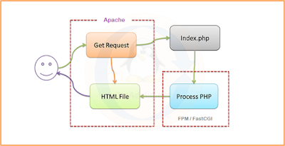
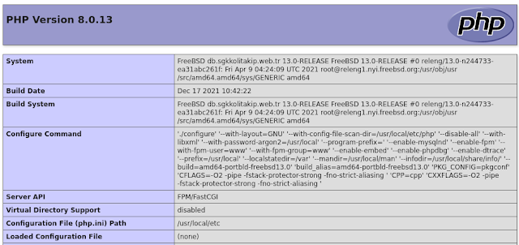

<!-- Bu makale Bedreddin Şahbaz tarafından yazılmıştır. BSD-3-Clause ile ruhsatlanmıştır. -->

# FreeBSD 13 Üzerinde PHP-FPM ve Apache Yapılandırması

Bu dökümanda FreeBSD 13 sistemimiz üzerinde kurulu Apache sunucumuzu php-fpm kullanarak PHP çalıştırır hale getireceğiz. Malum bu işi yapmanın diğer yolu; Apache’yi PHP modülü ile kullanmak. Bu dökümanda daha performanslı çalıştığı söylenen php-fpm ile Apache ve PHP’yi birbiri ile bağlayacağız.

Öncelikle Apache ve PHP paketlerini uygun modüller ve ayarlarla kurmamız lazım. Kurulumu ports ile yapıyorsanız ön tanımlı ayarlarda ihtiyacınız olan seçenekler seçili halde oluyor. Apache ve PHP için ön tanımlı değerlerle devam edebilirsiniz. Kurulumlar yapıldıktan sonra düzenleyeceğimiz ilk dosya httpd.conf olacak. Dosyayı açarak aşağıdaki satırları bulun ve örneğe göre düzenleyin. FreeBSD’de ports üzerinden kurulmuş Apache 2.4 için httpd.conf dosyasının yolu; ```/usr/local/etc/apache24/httpd.conf```

```
#
# Dynamic Shared Object (DSO) Support
#
...
LoadModule mpm_event_module libexec/apache24/mod_mpm_event.so
#LoadModule mpm_prefork_module libexec/apache24/mod_mpm_prefork.so
#LoadModule mpm_worker_module libexec/apache24/mod_mpm_worker.so
...
LoadModule proxy_module libexec/apache24/mod_proxy.so
...
LoadModule proxy_fcgi_module libexec/apache24/mod_proxy_fcgi.so
```

 Gerekli modülleri aktif hale getirmiş olduk. Modüllerle ilgili yaptığımız ayarın geçerli hale gelmesi için Apache servislerini yeniden başlatalım:

```
service apache24 start
```

# PHP-FPM

PHP-FPM (FastCGI Process Manager), ağır yüklü siteler için yararlı olabilen bazı ek özelliklere sahip alternatif bir PHP FastCGI uygulamasıdır. Yazının giriş bölümünde de bahsettiğimiz Apache web sunucusunun PHP modülü ile kullanımı aşağıda şematize edilmiştir.

.

İstemci (browser), sunucudan bir PHP sayfası talep ettiğinde Apache bu sayfayı PHP modülüne yorumlatıp sonucu istemciye gönderir. Burada PHP yorumlama işinin Apache servisi içinde yapıldığına dikkat edin. PHP-FPM kullandığımızda ise aşağıda bulunan yapı oluşacaktır.

.

Gördüğünüz gibi Apache bu sefer PHP kodlarının yorumlanmasını kendi içerisindeki PHP modülü yerine, bağımsız bir servis olarak çalışan FPM uygulamasına yaptırıyor. İşin mantığı genel olarak bu. Şimdi gerekli düzenlemeleri yapalım. PHP-FPM bir servis olarak çalışıyor demiştik. Öncelikle bu servisi çalıştırabilmek için /etc/rc.conf içerisine gerekli satırı ekleyelim:

```
php_fpm_enable="YES"
```

ve servisi çalıştıralım:

```
service php-fpm start
```

Ön tanımlı olarak php-fpm, arka planda 9000 numaralı TCP portunu dinleyecek ve yalnızca yerel makineden gelecek bağlantı isteklerini kabul edecek şekilde ayarlıdır. Eğer php-fpm servisini başka bir makinede çalıştırmayı planlamıyorsanız TCP yerine Unix soketi dinlemek daha hızlı ve daha güvenli bir yol olacaktır. Bu şekilde yapılandırmak için /usr/local/etc/php-fpm.d/www.conf dosyasını açalım ve aşağıdaki şekilde düzenleyelim:

```
user = www
group = www
listen = /tmp/php-fpm.sock
listen.owner = www
listen.group = www
listen.mode = 0660
```

Bu değişikliklerin etkili olabilmesi için php-fpm servisini yeniden başlatmak gerektiğini unutmayın. Aynı durum PHP ile ilgili yapacağınız tüm değişimlerde geçerli. mod_php kullandığınız zamanlarda Apache servisini yeniden başlatmak PHP ayarlarında yaptığınız değişimleri etkin hale getiriyordu ancak şu anda bu işi php-fpm servisi yaptığı için PHP ve php-fpm üzerinde yaptığımız tüm değişikliklerde php-fpm servisini yeniden başlatmayı unutmayalım.

```
service php-fpm restart
```

Son olarak Apache üzerinde küçük bir ayar yapmamız lazım. /usr/local/etc/apache24/Includes/php-fpm.conf dosyasını açalım ve şu içeriği ekleyelim:

```
<FilesMatch \.php$>
    SetHandler proxy:unix:/tmp/php-fpm.sock|fcgi://localhost/
    # use the following line instead if you didn't set PHP-FPM to listen on a Unix socket
    #SetHandler proxy:fcgi://127.0.0.1:9000
</FilesMatch>
```

Tüm ayarlamaları yaptık. Apache servisini yeniden başlatalım:

```
apachectl restart
```

Yaptığımız konfigürasyonu test edebiliriz. Web sunucumuzda bir php dosyası oluşturup <?php phpinfo();?> kodlarını bu sayfamıza yerleştirelim. Sayfayı ziyaret edelim:

.

Server API satırında FPM/FastCGI görüyorsanız tebrikler, sunucunuzda Apache+PHP-FPM yapılandırmasını doğru şekilde yapmışsınız.